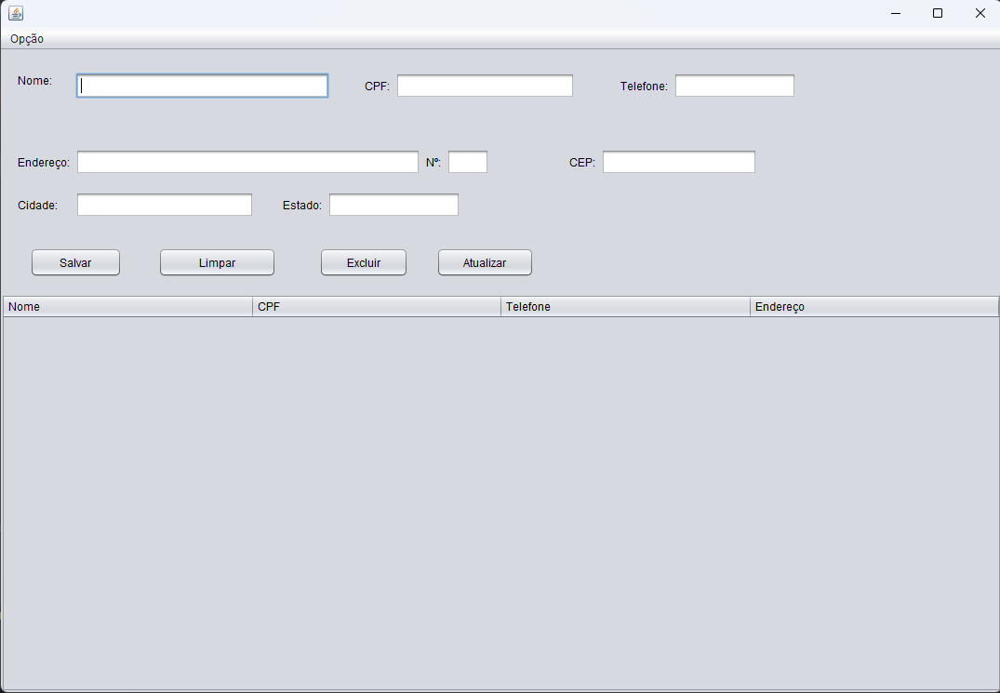

# 📋 Cadastro de Clientes — Java Swing

Sistema desktop de **cadastro de clientes (CRUD)** desenvolvido em Java com interface gráfica usando **Java Swing**. Permite cadastrar, consultar, atualizar e excluir clientes com dados completos de contato e endereço.

---

## 🖥️ Demonstração

 

---

## ✨ Funcionalidades

- ✅ **Cadastrar** novo cliente com validação de CPF duplicado
- 🔍 **Consultar** cliente pelo CPF
- ✏️ **Atualizar** dados de um cliente existente
- 🗑️ **Excluir** cliente pelo CPF
- 📋 **Listar** todos os clientes em tabela interativa
- 🧹 **Limpar** campos do formulário com um clique

---

## 🗂️ Estrutura do Projeto

```
CadastroClienteSwing/
├── src/
│   ├── cadastroclienteswing/
│   │   ├── CadastroClienteSwing.java   # Classe principal (main)
│   │   ├── TelaPrincipal.java          # Interface gráfica (JFrame)
│   │   └── TelaPrincipal.form          # Layout gerado pelo Form Editor
│   └── javaapplication1/
│       ├── domain/
│       │   └── Cliente.java            # Entidade Cliente (modelo)
│       └── dao/
│           ├── IClienteDAO.java        # Interface do padrão DAO
│           └── ClienteMapDAO.java      # Implementação com HashMap
└── ...
```

---

## 🧱 Arquitetura

O projeto segue o padrão **DAO (Data Access Object)**, separando a lógica de acesso a dados da camada de apresentação:

| Camada | Classe | Responsabilidade |
|--------|--------|------------------|
| **Domínio** | `Cliente.java` | Entidade com atributos e getters/setters |
| **DAO (Interface)** | `IClienteDAO.java` | Contrato com os métodos CRUD |
| **DAO (Implementação)** | `ClienteMapDAO.java` | Armazenamento em memória com `HashMap` |
| **View** | `TelaPrincipal.java` | Interface gráfica com Java Swing |
| **Main** | `CadastroClienteSwing.java` | Ponto de entrada da aplicação |

---

## 📦 Atributos do Cliente

| Campo | Tipo | Descrição |
|-------|------|-----------|
| `nome` | `String` | Nome completo |
| `cpf` | `String` | CPF (usado como chave única) |
| `tel` | `Long` | Telefone |
| `end` | `String` | Endereço (logradouro) |
| `numero` | `Integer` | Número do endereço |
| `cep` | `String` | CEP |
| `cidade` | `String` | Cidade |
| `estado` | `String` | Estado |

---

## 🚀 Como Executar

### Pré-requisitos

- [Java JDK 8+](https://www.oracle.com/java/technologies/downloads/) instalado
- IDE recomendada: [Apache NetBeans](https://netbeans.apache.org/) ou [IntelliJ IDEA](https://www.jetbrains.com/idea/)

### Passos

1. **Clone o repositório:**
   ```bash
   git clone https://github.com/OKallus/CadastroClienteSwing.git
   ```

2. **Abra na sua IDE:**
   - No NetBeans: `File → Open Project` e selecione a pasta do projeto
   - No IntelliJ: `File → Open` e selecione a pasta do projeto

3. **Execute:**
   - Clique em **Run** ou pressione `F6` (NetBeans) / `Shift+F10` (IntelliJ)

---

## 🛠️ Tecnologias Utilizadas

- **Java** — Linguagem principal
- **Java Swing** — Interface gráfica desktop
- **HashMap** — Armazenamento em memória (sem banco de dados)
- **Padrão DAO** — Separação de responsabilidades

---

## 📌 Observações

- Os dados são armazenados **em memória** (HashMap), ou seja, são perdidos ao fechar a aplicação. Uma evolução futura pode integrar banco de dados (ex: MySQL, SQLite).
- O **CPF** é utilizado como identificador único de cada cliente.

---

## 👤 Autor

Feito por **Karllus**  
[](https://github.com/OKallus)

---

## 📄 Licença

Este projeto está sob a licença MIT. Veja o arquivo [LICENSE](LICENSE) para mais detalhes.
